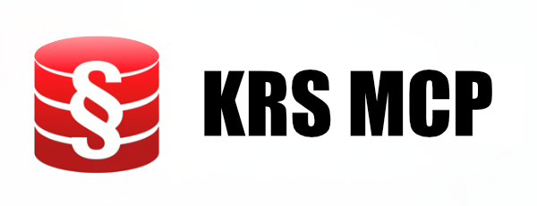

# krs-poland-mcp-server

The MCP server for KRS Poland public API.

## Installation

To install the package, run the following command:

```bash
npm install -g krs-poland-mcp-server
```

## Usage with NPX

You can also use `npx` to run the server without installing it globally:

```bash
npx krs-poland-mcp-server
```

## Usage

After installation, you can run the server with the following command:

```bash
krs-poland-mcp-server
```

Alternatively, you can run the server using `npm start`:

```bash
npm start
```

## Usage with LLM clients

This MCP server can be used to provide tools to LLM clients. To serve the tools, run the following command:

```bash
npx krs-poland-mcp-server serve
```

## Author

Piotr Kolawa ([@pkolawa](https://github.com/pkolawa))

## License

This project is licensed under the MIT License - see the [LICENSE](LICENSE) file for details.